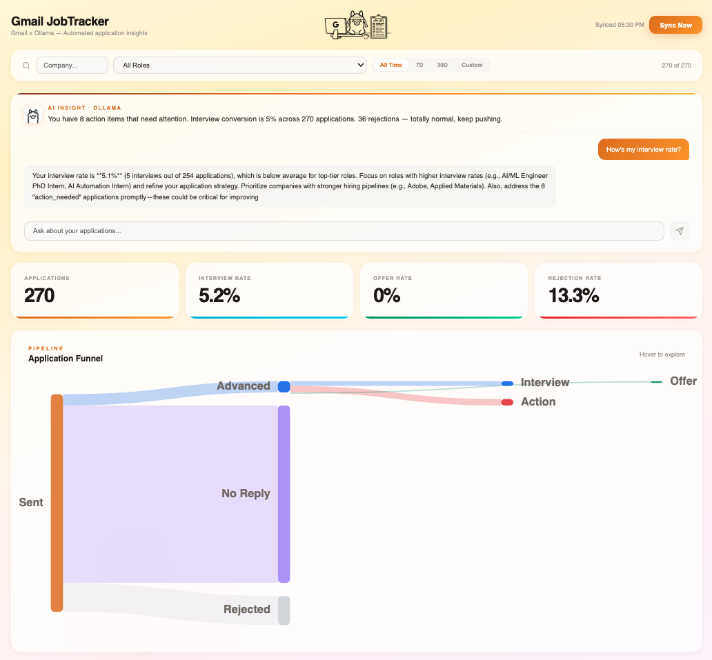
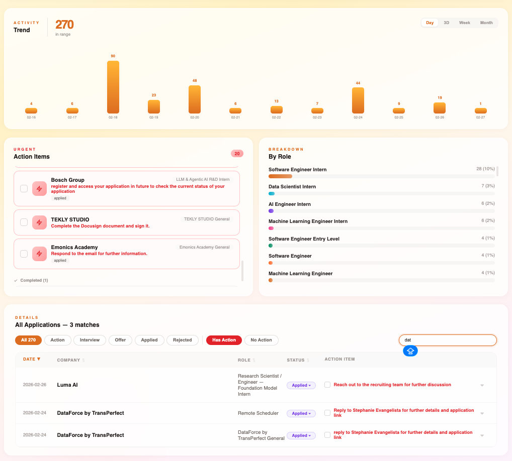

# Gmail Job Tracker

Gmail Job Tracker is a full-stack app that pulls job-related emails from Gmail, classifies them with local LLMs via Ollama, stores the results in SQLite, and shows everything in a React dashboard.

It is designed for job search tracking: application confirmations, recruiter outreach, interview invitations, rejections, offers, and follow-up action items all in one place.

<p align="center">
  
</p>

<p align="center">
  
</p>

<p align="center">
  
</p>

## Highlights

- Gmail sync with configurable search filters
- Local LLM-powered email classification using Ollama
- FastAPI backend with SQLite persistence
- React dashboard for trends, funnel, action items, and application history
- AI chat assistant that answers questions using your application data
- Manual status updates and action item tracking

## Stack

- Backend: FastAPI, SQLite
- Frontend: React + Vite
- LLM runtime: Ollama
- Gmail access: Google OAuth + Gmail API

## How It Works

```text
Gmail API -> Fetch emails -> Classify with Ollama -> Store in SQLite -> Visualize in dashboard
```

Main flow:

1. Fetch job-related emails from Gmail.
2. Analyze them with a local model.
3. Group emails into applications.
4. Display progress, trends, statuses, and action items in the UI.

## Features

- Email ingestion from Gmail with date filters and max-result limits
- Classification across common recruiting states such as applied, recruiter outreach, interview, rejection, offer, and action needed
- Role normalization to keep similar titles grouped together
- Dashboard cards, trend chart, sankey funnel, and role breakdown
- Expandable application table with linked source emails
- Search, sorting, status override, and action item toggles
- Streaming AI chat endpoint backed by your local LLM provider

## Project Structure

```text
gmail_job_app_tracker/
  api/                FastAPI routes
  db/                 SQLite schema and queries
  frontend/           React dashboard
  gmail/              Gmail auth and fetching
  llm/                Prompts and model integration
  config.py           App configuration
  main.py             CLI entry point
  setup.sh            One-time setup script
  start.sh            Start backend and frontend together
```

## Requirements

- Python 3.9+
- Node.js 18+
- Ollama installed locally
- Gmail API credentials from Google Cloud

Recommended Ollama models:

- `qwen2.5-coder:7b` for email classification
- `qwen3:8b` for chat

## Setup

### 1. Clone the repo

```bash
git clone https://github.com/sherryfish321/gmail-job-tracker.git
cd gmail_job_app_tracker
```

If your local folder name is already `gmail_job_app_tracker`, that's fine. The GitHub repo name and local folder name do not need to match exactly.

### 2. Install Ollama and models

Install Ollama from https://ollama.com, then pull the required models:

```bash
ollama pull qwen2.5-coder:7b
ollama pull qwen3:8b
```

### 3. Create Google OAuth credentials

This app needs a `credentials.json` file in the project root.

Google Cloud steps:

1. Create a project in Google Cloud Console.
2. Enable the Gmail API.
3. Configure the OAuth consent screen.
4. Create an OAuth Client ID with application type `Desktop app`.
5. Download the JSON file and rename it to `credentials.json`.
6. Place it in the project root.

The first time you run sync, a browser window will open for Gmail authorization. After approval, a `token.json` file will be generated automatically.

### 4. Run setup

```bash
chmod +x setup.sh start.sh
./setup.sh
```

## Running the App

### Start backend and frontend

```bash
./start.sh
```

### Sync first, then launch

```bash
./start.sh --sync
```

### Sync a specific date range

```bash
./start.sh --sync --after 2026/02/01 --before 2026/02/28 --max 200
```

Frontend:

```text
http://localhost:5173
```

Backend:

```text
http://localhost:8000
```

## CLI Usage

```bash
python main.py
python main.py --serve
python main.py --sync
python main.py --sync --after 2026/02/01 --before 2026/02/15 --max 50
```

Command meanings:

- `python main.py`: run sync, then start the API server
- `python main.py --serve`: start only the API server
- `python main.py --sync`: fetch and analyze emails without starting the server

## API Overview

Core endpoints:

- `GET /api/stats`
- `GET /api/applications`
- `GET /api/applications/{app_id}/emails`
- `GET /api/weekly`
- `GET /api/roles`
- `POST /api/sync`
- `POST /api/chat`
- `POST /api/chat/stream`

## Troubleshooting

### `403 Permission denied` when pushing to GitHub

Your git remote is probably pointing to a repo you do not own. Check with:

```bash
git remote -v
```

Then update it to your own repo:

```bash
git remote remove origin
git remote add origin https://github.com/sherryfish321/gmail-job-tracker.git
git push -u origin main
```

### `ERROR: venv not found. Run ./setup.sh first.`

Run:

```bash
./setup.sh
```

### `Ollama not detected at localhost:11434`

Start Ollama in another terminal:

```bash
ollama serve
```

### Google OAuth `access_denied`

If your app is still in testing mode, make sure your Gmail account is added as a test user in Google Cloud OAuth settings.

### Port already in use

Free the ports and restart:

```bash
kill -9 $(lsof -ti :8000) 2>/dev/null
kill -9 $(lsof -ti :5173) 2>/dev/null
./start.sh
```

## Notes

- `credentials.json` and `token.json` should not be committed to GitHub.
- Ollama is optional for UI startup, but required for classification and chat.
- The app stores local data in `tracker.db`.

## Roadmap Ideas

- Better deduplication across email threads
- More granular status categories
- Export to CSV or Notion
- Hosted auth and deployment option
- More model/provider choices

## License

Add a license here if you plan to open-source the project publicly.
